# Angular inDepth

http://frontendmasters.com/courses/angularjs-in-depth/

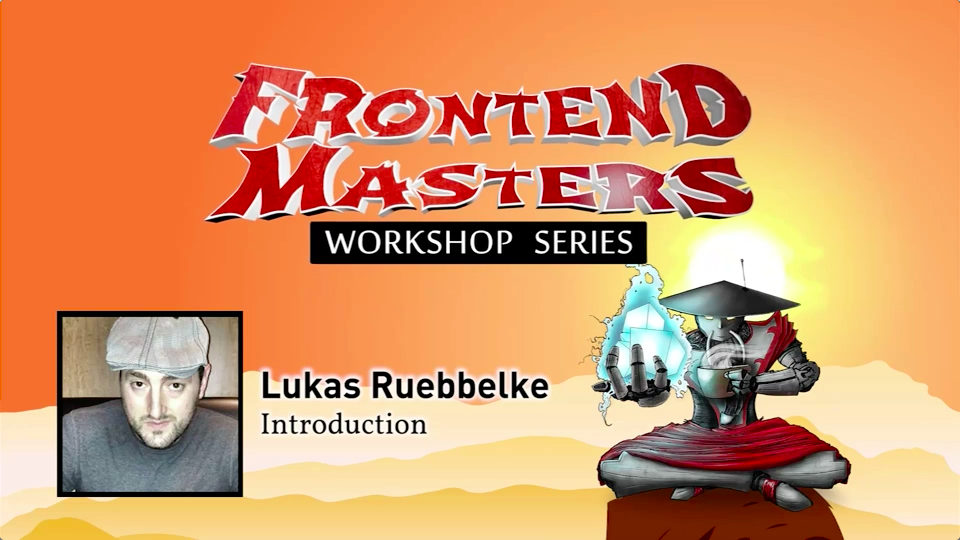  

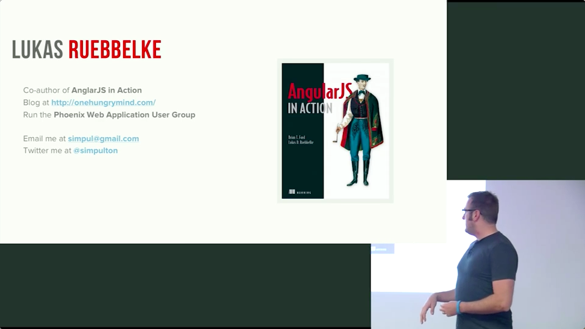

* http://manning.com/
* http://manning.com/resig/
* http://manning.com/mikowski/
* http://manning.com/bford/

#### One Hungry Mind | all your web application are belong to usOne ...
http://onehungrymind.com/

Blog by @simpulton

#### AngularJS Philly ETE Slides
http://onehungrymind.com/angularjs-philly-ete-slides/

Linking function is for *fashion*.
Controller function is for *functionality*.

#### A Few of My Favorite AngularJS Resources – January Edition
http://onehungrymind.com/angularjs-resources-january-edition/

https://www.diigo.com/user/strajk/learn-angular

#### Notes On AngularJS Scope Life-Cycle
http://onehungrymind.com/notes-on-angularjs-scope-life-cycle/

The $apply() method, which is what you call when you are transitioning from non-angular world into angular world, calls $digest()

Knockout dependency tracking is a clever feature for a problem which angular does not have.

dirty-checking allows you to do POJO, whereas KO and backbone force you to inherit from their classes, and access your data through accessors.

video games and GPUs use the dirty-checking approach, specifically because it is consistent

$digest processes all the watchExpressions for the current scope and its children.

[AngularJS Sticky Notes Pt 1 – Architecture](http://onehungrymind.com/angularjs-sticky-notes-pt-1-architecture/)

[AngularJS Sticky Notes Pt 2 – Isolated Scope](http://onehungrymind.com/angularjs-sticky-notes-pt-2-isolated-scope/)

[AngularJS – Handy Tricks With Developer Tools](http://onehungrymind.com/angularjs-handy-tricks-with-developer-tools/)

[AngularJS and DOM Manipulation](http://onehungrymind.com/angularjs-and-dom-manipulation/)

[AngularJS – Communicating Between Controllers](http://onehungrymind.com/angularjs-communicating-between-controllers/)

[Building a Website with AngularJS – Routes and Partials](http://onehungrymind.com/building-a-website-with-angularjs-routes-and-partials/)

[Lukas Ruebbelke (simpulton) on Twitter](https://twitter.com/simpulton)

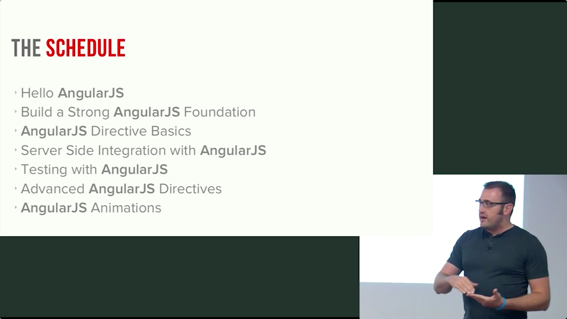  

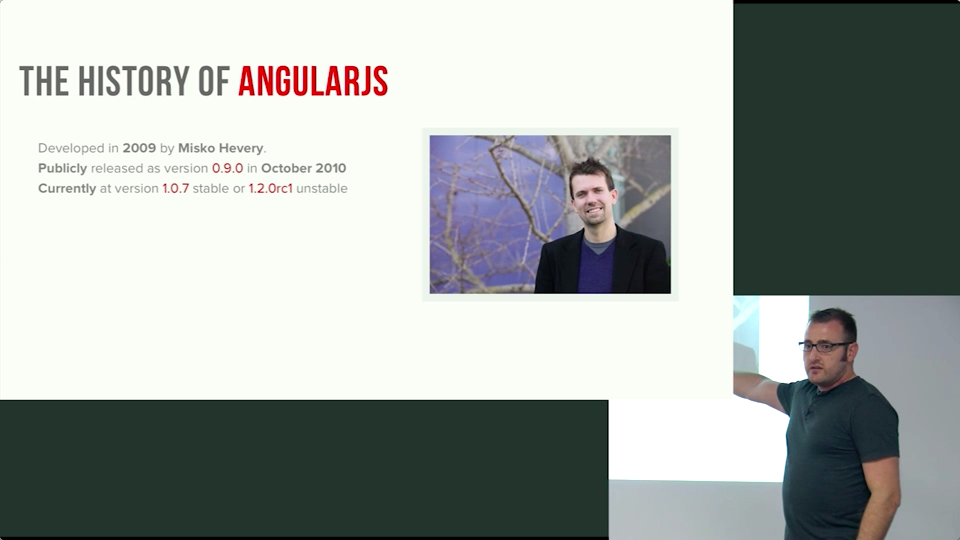

Really good fit for CRUD applications.

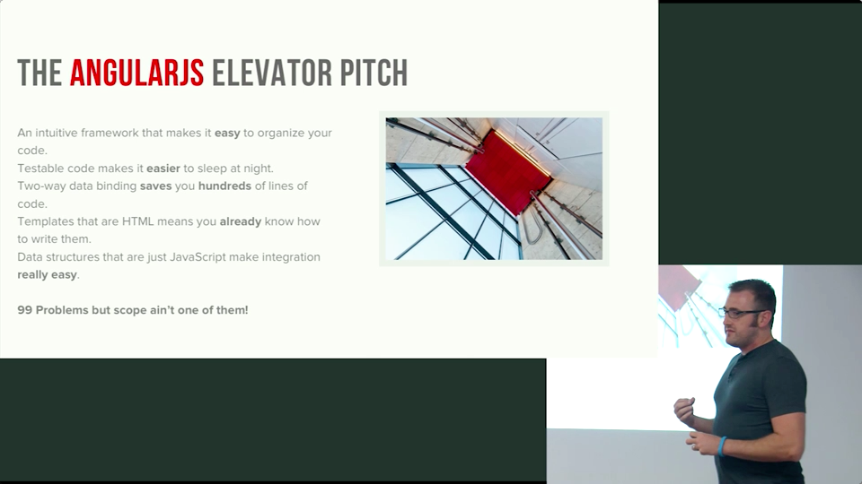

Organize code – compare with plain jQuery.

That code doesn’t break, doesn’t mean it works.

It’s possible to integrate into legacy apps.

Angular will impress you even after few years.

  

yo angular:route main

  

  

Module is container.

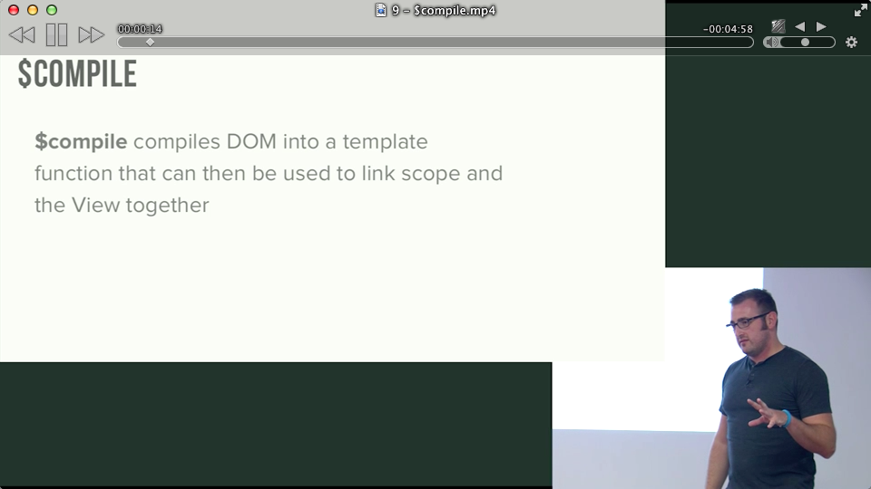  

At lowest level, there is compilation cycle.

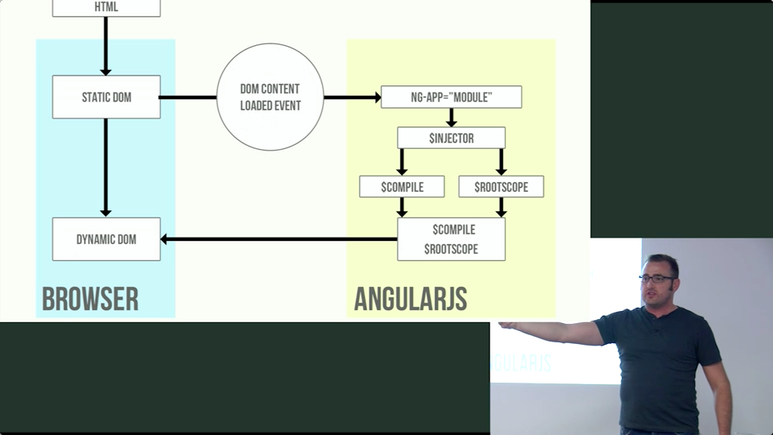  

  

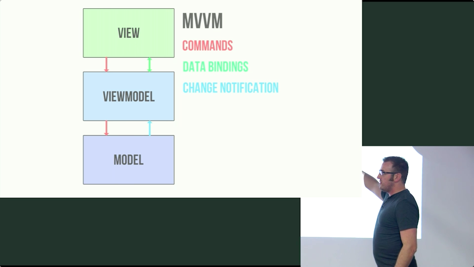  

  

  

  

Hooks inside digest cycle.

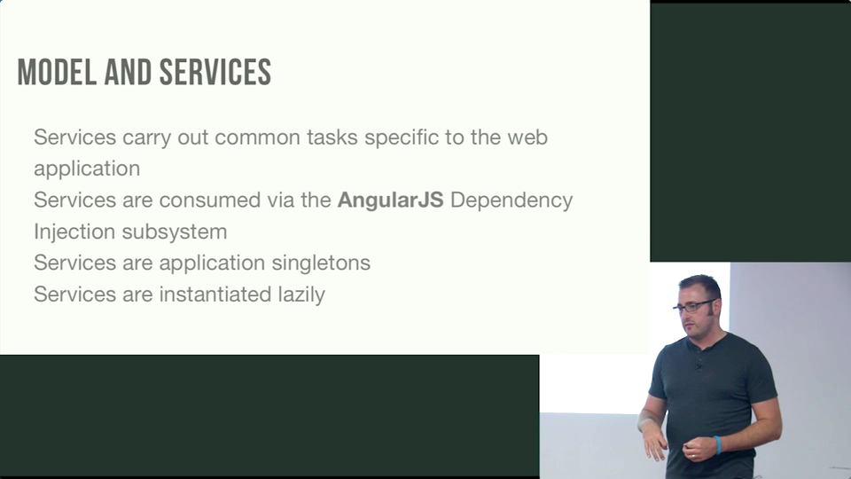  

One service per injector.

  

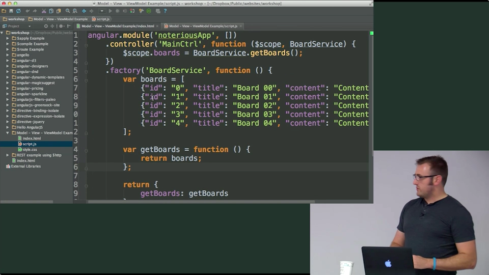

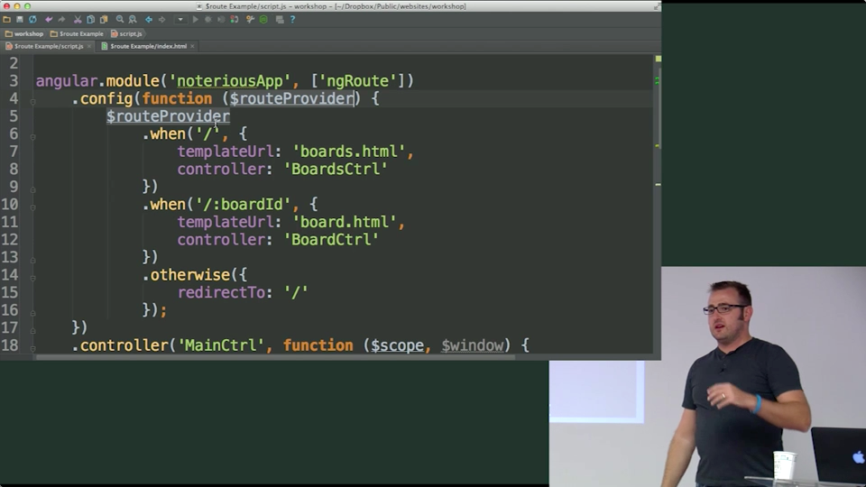  

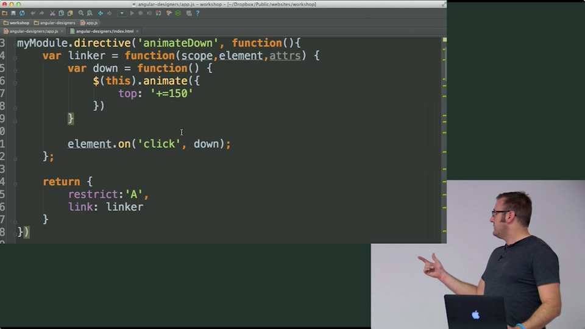  

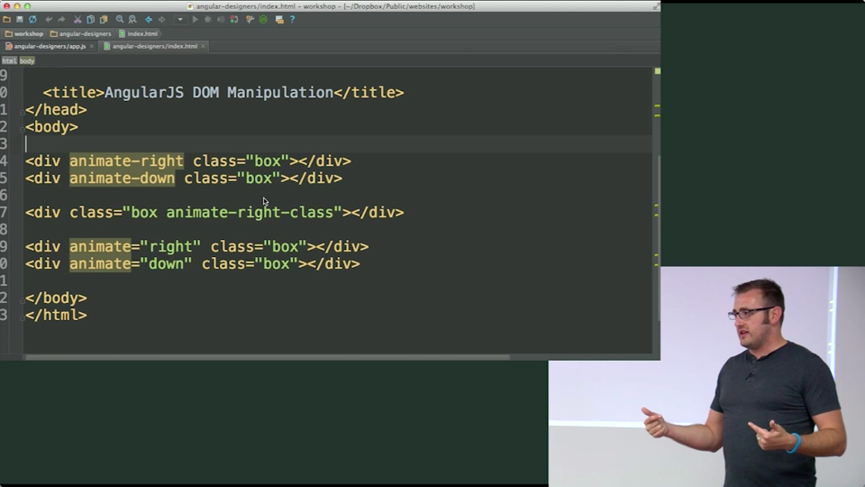  

***

#### My review:

It was sooo bad.

Teacher cannot answer no question.

Full of, kinda, empty, in a manner, words, essentially.

Horrible examples.